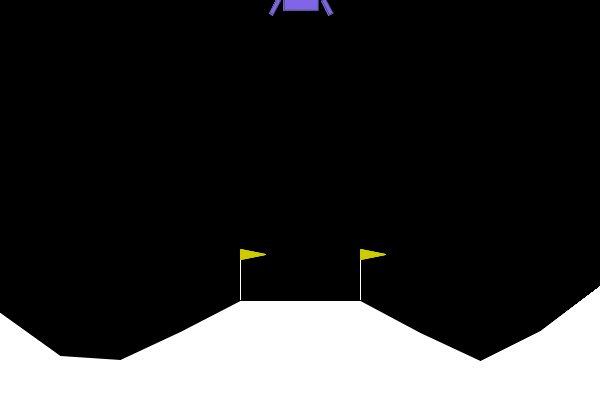

# Lunar Lander Deep Q-Learning 🚀

Welcome to the Lunar Lander Deep Q-Learning project, where we leverage the power of Deep Q-Learning and the Stable Baselines library to train an agent capable of landing a spacecraft on the moon! 🌕🚀

## Overview 📖

In this project, we tackle the challenging Lunar Lander environment using reinforcement learning techniques. Our agent learns to navigate the lunar landscape, adjusting thrusters to achieve a smooth and safe landing. We employ Deep Q-Learning, a powerful algorithm that combines deep neural networks with Q-learning, to enable our agent to make intelligent decisions in a complex and dynamic environment.

## Features 🌟

- **Deep Q-Learning**: Utilize state-of-the-art reinforcement learning techniques to train the agent.
- **Stable Baselines Library**: Leverage the Stable Baselines library, a set of high-quality implementations of reinforcement learning algorithms.
- **Customizable Environment**: Easily adapt the project to other environments or tweak hyperparameters to suit your needs.
- **Visualization**: Observe the training progress and the agent's performance through visualizations and statistics.

Embark on the lunar exploration journey with our Deep Q-Learning agent! If you have any questions or feedback, don't hesitate to reach out. Happy landing! 🌌👨‍🚀

